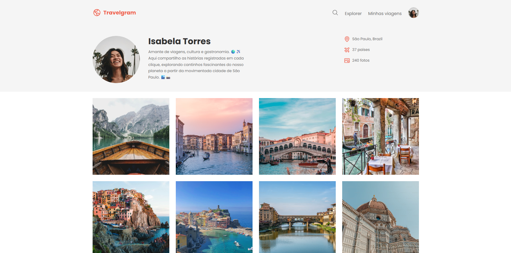

# 🌍 Travelgram


Travelgram is a front-end project developed with pure HTML and CSS that simulates a profile page for travel enthusiasts. Inspired by photo-based social networks like Instagram, the application focuses on showcasing destinations and travel images through a clean, responsive, and visually appealing layout.

## ✈️ About the project

This page represents the profile of Isabela Torres, a traveler passionate about culture and gastronomy. She shares her experiences around the world through photos and summarized information in the header.

The interface includes:

- Navigation with custom icons
- Header with photo, bio, and personal information
- Travel image gallery
- Footer with institutional links

## 🎯 Objectives

- Explore modern semantic HTML and modularized CSS practices
- Work with CSS variables and organize styles by component
- Apply responsive layout concepts with Flexbox
- Structure a visual portfolio for educational purposes or presentations

## 🧩 Project Structure

```bash
Travelgram/
├──assets/
│ ├── icons/
│ ├── images/
│ ├── Logo.svg
│ └── Profile pic.png
├── styles/
│ ├── global.css
│ ├── nav.css
│ ├── header.css
│ ├── main.css
│ ├── footer.css
│ └── index.css
├── index.html
└── .gitignore
```
## 💡 Technologies Used

- **HTML5** — semantic structure
- **CSS3** — styling using variables, Flexbox, and responsive layout

## 🚀 How to run

To run the project locally:

```bash
git clone https://github.com/cAlbertoRodrigues/Travelgram.git
cd Travelgram

After that, just open the index.html file in your browser.

🌐 Deploy
The project can be viewed through GitHub Pages:

🔗 Visit the website
